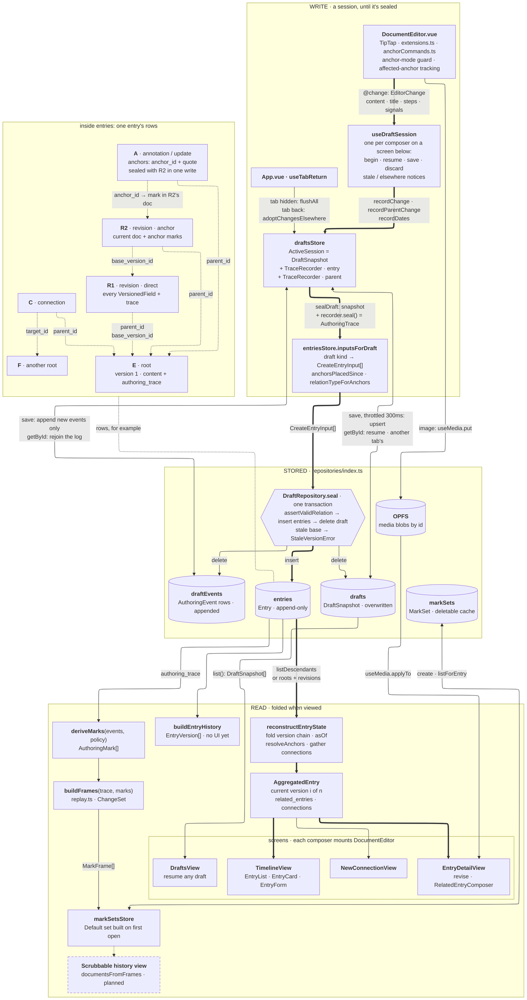

# Chronicle — Architecture

The whole app on one page: what each layer holds and how data moves between them. The docs in
CLAUDE.md's table own the details; this owns only the picture. Update it in the same change that
adds, removes or reroutes a store, table, repository or flow.

It uses Mermaid's ELK layout, which VS Code's built-in preview supports; a renderer without ELK
falls back to the default layout, which draws it less tidily.

**Reading it.** Arrows are data moving, labelled with what moves; two heads means both ways. Thick
is the path every saved entry takes, from keystroke to screen. Dotted is one row naming another by
id, or a link to something planned, which has a dashed box.

- **Write** — a session lives in `draftsStore` as a snapshot plus one `TraceRecorder` per
  document, flushed to two tables as it goes. Sealing turns it into entries in one transaction
  that also deletes the draft. [AUTHORING.md](./AUTHORING.md), "Drafts".
- **Stored** — `entries` is never rewritten; `drafts` and `draftEvents` are working space, and
  `markSets` a deletable cache. Media blobs sit in OPFS. Each repository has an in-memory twin for
  tests, held to the same `.contract.ts`. The panel dotted to `entries` is one entry's rows:
  [ENTRY_MODEL.md](./ENTRY_MODEL.md).
- **Read** — nothing is stored in its viewed form. An entry is folded from its rows on every read,
  and mark sets are built from its trace the first time its history is opened.

